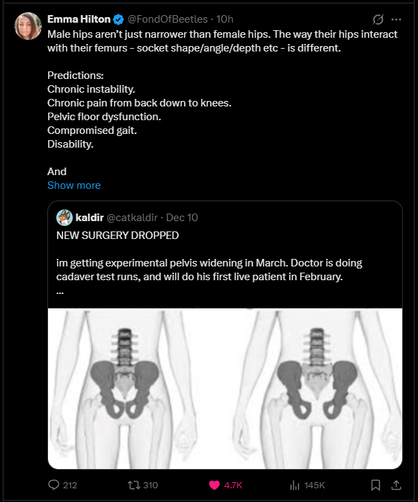

"My body, my choice" is a phrase that gets thrown around a lot today. It's so commonplace that the pro-abortion position has become known as the "pro-choice" position because the arguments for abortion almost always stem from some defense of supposed bodily autonomy. It should be obvious why this argument doesn't work for abortion though. Unless one is to conclude that a pregnant woman has 4 limbs, two sets of organs, two different blood types, and so on, its clear that an abortion does not just involve one body, but two. 

I appreciate such scientific arguments against abortion; the science of pregnancy certainly favors the pro-life movement. It is an undeniable biological fact that a new human life is created upon conception; it is when a unique set of dna is formed and a new organism begins to develop. Still, even when this is agreed upon, pro-abortion advocates will still claim bodily autonomy. The position becomes that so long as the baby growing in the womb is dependent on the mother for survival, abortion should be allowed. Ignoring the practical problems with creating a legal category for "viability," which is impossible to know the exact time of with certainty and varies greatly from pregnancy to pregnancy and also from place to place depending on the quality of healthcare, this argument still fails. An infant, and even a toddler, is entirely dependent on its parents for survival. Unless one is willing to get rid of child-neglect laws, which I don't see anyone lining up to do, claiming that abortion should be allowed as long as the baby is dependent on the mother doesn't make much sense. 

This brings me to the main problem I have with a lot of scientific arguments we make against abortion. It's not that they are wrong, or that they are weak, but that they're completely ignored. Pro-abortion advocates can completely agree with us on the science of pregnancy, but they'll just fall back on making philisophical arguments. "It might be a human, but it isn't a person yet," "It's dependent on my body, so its still my choice," and so on. Funnily enough, the pro-life position is regularly attacked for being a "religious" position. Not that I grant that a position being a religious one makes it weak or false, but that claim also could not be further from the truth of how most abortion conversations play out. Far too often pro-life people make the conversation entirely about biology, whilst their opponents are making solely philisophical and moral arguments. We almost weaken our position by making it solely about biology; at the very least, we make conversations unfruitful because each side is debating something entirely different. 

For Christians to win the culture war, we need to stop adopting the liberal premises. Forget about the "it's not your body" arguments; we restrict bodily autonomy all the time. Child neglect laws, hard drugs, assisted suicide, selling your own organs, wearing helmets on a motorcylce, and I could keep going but you get the point. We give up so much ground when we basically say, "well, if it was your body, you'd be right." We do this same sort of thing on the transgenderism issue. "No trans surgeries for kids, but adults can do what they want!" Excuse me? We don't let a doctor chop off a mentally ill person's right arm when they decide they only want one arm now. Yet, when the confused (and most likely porn-addicted and autogynephilic) 18 year old male wants to be a woman, we chop his balls of and give him chronic back and leg pain to widen his hips to appear more feminine?

*A new transgender surgery being promoted.*

Absolutely not. So many American "conservatives" get frightened by the idea of banning pornography, banning all transgender surgeries, and so on because "bodily autonomy" is just the water we swim in. The arguments are so ubiquitous in our culture that many people, even well-meaning Christians, have never even questioned if that's a legitamate principle. Certainly, there is no biblical argument against the idea that government has the authority to regulate any of those things. No where in the Bible can you find some broad "right to bodily autonomy." Even in an American context, if anyone thinks that the founders wouldn't have supported banning pornography or transgender surgeries or abortion or whatever else because of some "right to bodily autonomy," I have a bridge to sell you. Not only would they have obviously supported all of those things, they wouldn't have even recognized or understood the bodily autonomy argument. 

In reality, it's not "my body, my choice." It's actually "God's body, his choice, your stewardship."

